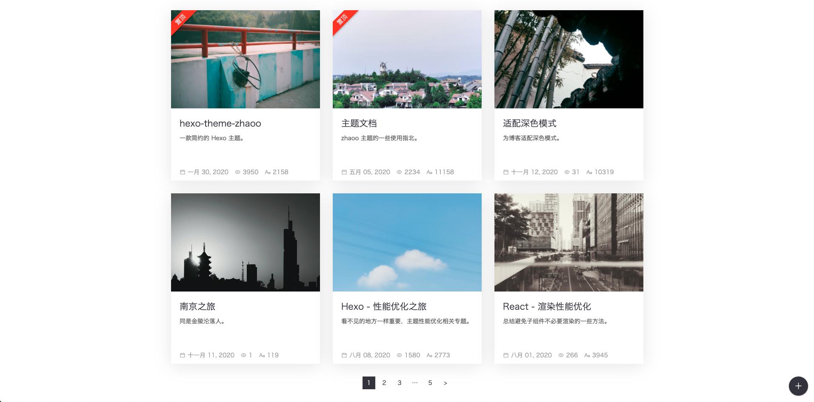
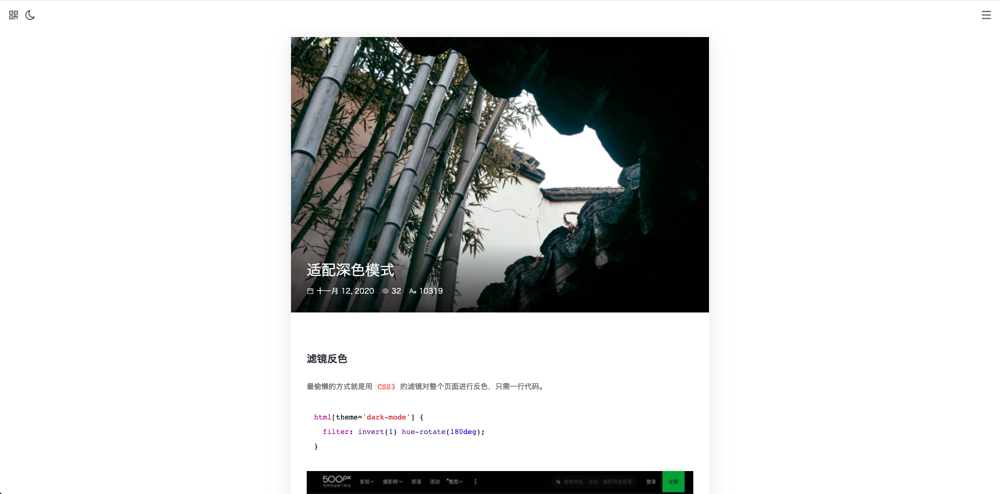
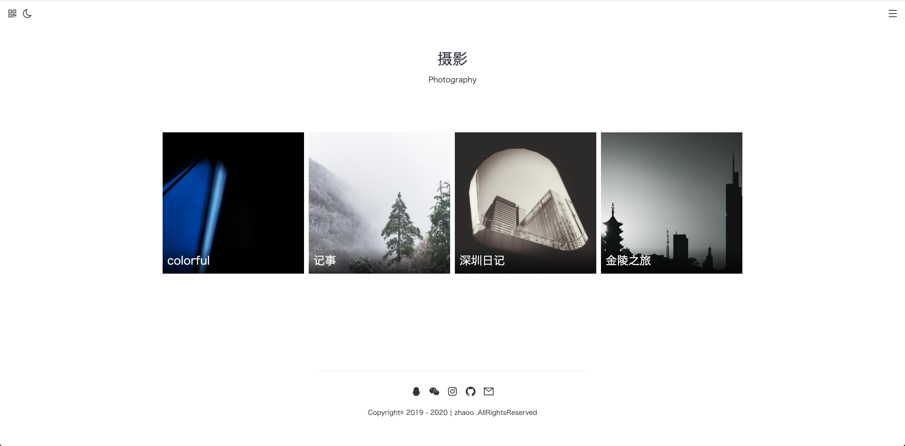
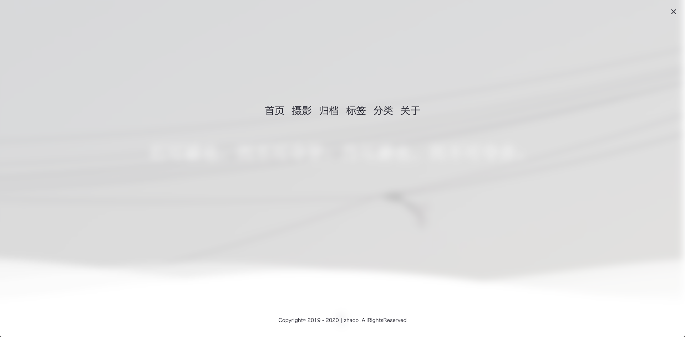

<div align="right">
  语言:
  <a title="简体中文" href="https://github.com/zhaoo/hexo-theme-zhaoo/blob/master/README.md">🇨🇳</a>
  <a title="English" href="https://github.com/zhaoo/hexo-theme-zhaoo/blob/master/README_EN.md">🇺🇸</a>
</div>

<div align="center">
  <a href="https://github.com/zhaoo/hexo-theme-zhaoo/" target="_blank" rel="noopener noreferrer">
    
  </a>
</div>

<h3 align="center">一款简约的 Hexo 主题</h3>  

<div align="center">
  <a href="https://github.com/zhaoo/hexo-theme-zhaoo/releases" target="_blank" rel="noopener noreferrer">
    
  </a>
  <a href="https://hexo.io" target="_blank" rel="noopener noreferrer">
    
  </a>
  <a href="https://nodejs.org" target="_blank" rel="noopener noreferrer">
    
  </a>
  <a href="(https://github.com/zhaoo/hexo-theme-zhaoo/blob/master/LICENSE" target="_blank" rel="noopener noreferrer">
    
  </a>
</div>

<br/>

<div align="center">
  文档：<a href="https://www.izhaoo.com/2020/05/05/hexo-theme-zhaoo-doc/" target="_blank" rel="noopener noreferrer">配置文档</a>&nbsp;&nbsp;&nbsp;&nbsp;预览：<a href="https://www.izhaoo.com/" target="_blank" rel="noopener noreferrer">zhaoo</a>&nbsp;&nbsp;&nbsp;&nbsp;小程序：<a href="https://github.com/zhaoo/hexo-weapp-zhaoo" target="_blank" rel="noopener noreferrer">hexo-weapp-zhaoo</a>
</div>

## 预览

- [zhaoo's Blog](https://www.izhaoo.com)
- [Handwer's Blog](https://blog.handwer-std.top/)
- [与李的个人博客](https://blog.javayuli.cn)
- [Live And Learn](https://kangshitao.github.io/)
- [Hexo](https://www.actor360.xyz/)
- [阿蓝故事](https://blog.zhangxiaocai.cn/)
- [kilic の 部落格](https://kilicmu.github.io/)
- [杨云召](https://flywith24.gitee.io/)
- [Mtaun](https://mtaun.top/)
- [汐语](https://xywangb.cn/)
- [Meizi's Blog](http://www.meizia.net/)
- [少年民仔](https://www.feminzai.com/)
- [iaosee's Blog](https://www.iaosee.com/)
- [Yin Blog](http://xuzhimo.top/)
- [卞卞不是便便](https://www.bianxr.com/)
- [CodeGorgeous](https://codegorgeous.github.io/)
- [Winterchen's Blog](https://blog.winterchen.com/)
- [rt](https://rt95.gitee.io)
- [杨某人的FOB](http://www.yzpdot.com/)
- [小州的博客](http://xiaozhoujun.gitee.io/)
- [DesnLee的博客](https://www.desnlee.com/)
- [米斯特乌小站](https://m.wuzhiping.top/)
- [冷星的博客-前端荣耀](https://lengxing.club)
- [JIACHENG的博客-leetcode mark](https://leetcode-mark.herokuapp.com/index.html)
- [中国的中古](https://medieval-china.club/)
- [樱白](https://cherry-white.github.io/)
- [隨遇而安](https://yuweikuo.github.io/)
- [Aljen Blog](https://jsregret.cn/)

（如果您正在使用 zhaoo 主题，欢迎展示您的博客哦，只需在 `README.md` 文件中加入您的博客，提交 PR 即可。）

## 特性

- [x] 设计理念：简约 & 响应式 & 动效
- [x] 评论：`Gitalk`、`Valine`、`畅言`
- [x] 反馈：[DaoVoice](http://www.daovoice.io/)、[腾讯兔小巢](https://txc.qq.com/)
- [x] 统计：`LeanCloud`、`百度`、`CNZZ`、`谷歌` 及 SEO优化
- [x] 深色模式
- [x] 格言，支持接入 [一言](https://hitokoto.cn/)、[今日诗词](https://www.jinrishici.com/) 等第三方动态格言
- [x] 预览图，支持接入 [Unsplash](https://unsplash.com/)、[必应每日图片](https://cn.bing.com/) 等第三方动态图片
- [x] 相册，支持瀑布流加载
- [x] `highlight` 代码高亮
- [x] `FancyBox` 图片灯箱
- [x] `Pjax` 无刷新加载
- [x] `lazyload` 图片懒加载
- [x] `支付宝、微信` 打赏
- [x] 定制 `主题风格`、`CDN`、`埋点脚本`、`社交链接`、`版权说明`、`二维码` 等

## 截图










## 安装

安装 Hexo 后进入根目录：

```bash
$ cd hexo
```

安装 zhaoo 主题：

```bash
$ git clone https://github.com/zhaoo/hexo-theme-zhaoo.git themes/zhaoo
```

## 使用

修改 Hexo 根目录下的 `_config.yml` 文件启用 zhaoo 主题：

```yml
theme: zhaoo
```

建议将文章数量改为**9**篇，启用代码高亮效果：

```yml
index_generator:
  path: ''
  per_page: 9
  order_by: -date

highlight:
  enable: true
  line_number: true
  auto_detect: true
  hljs: true
  tab_replace:
```

启动 Hexo 服务器预览：

```bash
$ hexo clean && hexo s
```

## 配置

修改主题目录下的 `_config.yml` 文件，配置相关功能：

建议参考 [配置文档](https://www.izhaoo.com/2020/05/05/hexo-theme-zhaoo-doc/)、[_config.yml](https://github.com/zhaoo/hexo-theme-zhaoo/blob/master/_config.yml)、[_example](https://github.com/zhaoo/hexo-theme-zhaoo/tree/master/_example) 进行配置

## 更新

移动到 zhaoo 主题目录：

```bash
$ cd themes/zhaoo
```

从 GitHub 获取更新：

```bash
$ git pull
```

## 相关

* 小程序：[hexo-weapp-zhaoo](https://github.com/zhaoo/hexo-weapp-zhaoo) (为 Hexo 定制的博客小程序)
* 插件：[hexo-generator-restful-zhaoo](https://github.com/zhaoo/hexo-generator-restful-zhaoo) (Hexo RESTful 接口)
* 交流群：550262893

## 贡献

[](https://github.com/zhaoo/hexo-theme-zhaoo/graphs/contributors)

感谢所有贡献者！欢迎提交代码~ （请提交至 `develop` 分支）

## 趋势

[](https://starchart.cc/zhaoo/hexo-theme-zhaoo)

## 协议

[MIT](https://github.com/zhaoo/hexo-theme-zhaoo/blob/master/LICENSE) License
