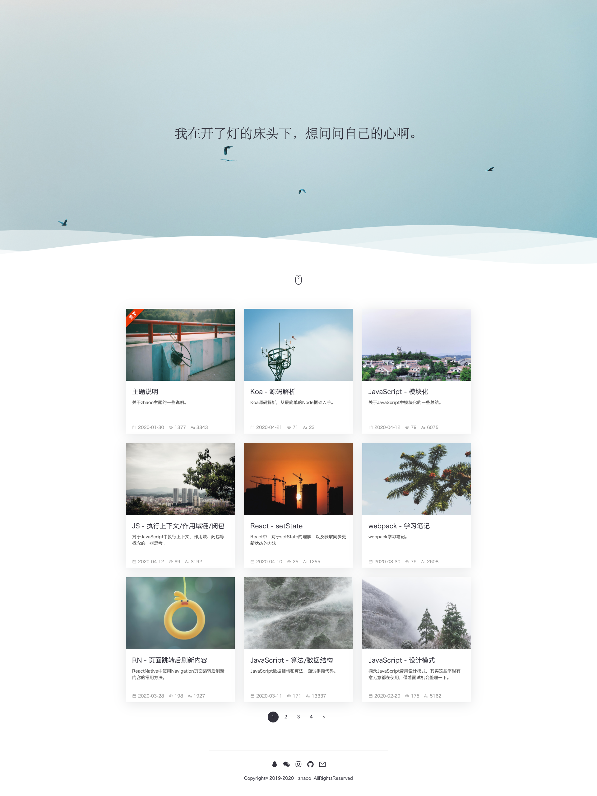

<div align="right">
  Language:
  <a title="简体中文" href="https://github.com/izhaoo/hexo-theme-zhaoo/blob/master/README.md">🇨🇳</a>
  <a title="English" href="https://github.com/izhaoo/hexo-theme-zhaoo/blob/master/README_EN.md">🇺🇸</a>
</div>

<div align="center">
  <a href="https://github.com/izhaoo/hexo-theme-zhaoo/" target="_blank" rel="noopener noreferrer">
    
  </a>
</div>

<h3 align="center">A simple theme for Hexo</h3>  

<div align="center">
  <a href="https://github.com/izhaoo/hexo-theme-zhaoo/releases" target="_blank" rel="noopener noreferrer">
    
  </a>
  <a href="https://hexo.io" target="_blank" rel="noopener noreferrer">
    
  </a>
  <a href="https://nodejs.org" target="_blank" rel="noopener noreferrer">
    
  </a>
  <a href="(https://github.com/izhaoo/hexo-theme-zhaoo/blob/master/LICENSE" target="_blank" rel="noopener noreferrer">
    
  </a>
</div>

## Rreview

- [zhaoo's Blog](https://www.izhaoo.com)
- [卞卞不是便便](https://www.bianxr.com/)
- [CodeGorgeous](https://codegorgeous.github.io/)

（If you are using the zhaoo theme, welcome to show your blog, just add your blog to the `README.md` and PR.）

## Characteristic

- [x] Simple & Responsive & Animation
- [x] `highlight` code highlighting
- [x] `Gitalk` comment
- [x] `FancyBox` lightbox
- [x] `Pjax`
- [x] `lazyload`
- [x] `LeanCloud` statistical pv & uv
- [x] `Alipay, Wechat` donate
- [x] Galleries, pictures support waterfall (`justifiedGallery`)
- [x] Motto, can use plugin `hexo-plug-motto`to achieve dynamic motto
- [x] Customized `Theme Style`、`CDN`、`Embedded Script`、`Social Link`、`Copyright` and more

## Screenshots




## Install

After installing Hexo, go to the root directory:

```bash
$ cd hexo
```

To install zhaoo themes:

```bash
$ git clone https://github.com/izhaoo/hexo-theme-zhaoo.git themes/zhaoo
```

## Use

Modify the file `_config.yml` in the Hexo root directory to enable the zhaoo theme:

```yml
theme: zhaoo
```

It is recommended to change the number of articles to **9** and enable code highlighting:

```yml
index_generator:
  path: ''
  per_page: 9
  order_by: -date

highlight:
  enable: true
  line_number: true
  auto_detect: true
  hljs: true
  tab_replace:
```

Start preview of Hexo server:

```bash
$ hexo clean && hexo s
```

## Config

Modify the file `_config.yml` in the theme directory to configure related functions:

It is recommended to refer to [_config.yml](https://github.com/izhaoo/hexo-theme-zhaoo/blob/master/_config.yml) for configuration

## Update

Jump to the theme directory：

```bash
$ cd themes/zhaoo
```

Get update from GitHub：

```bash
$ git pull
```

## License

[MIT](https://github.com/izhaoo/hexo-theme-zhaoo/blob/master/LICENSE) License