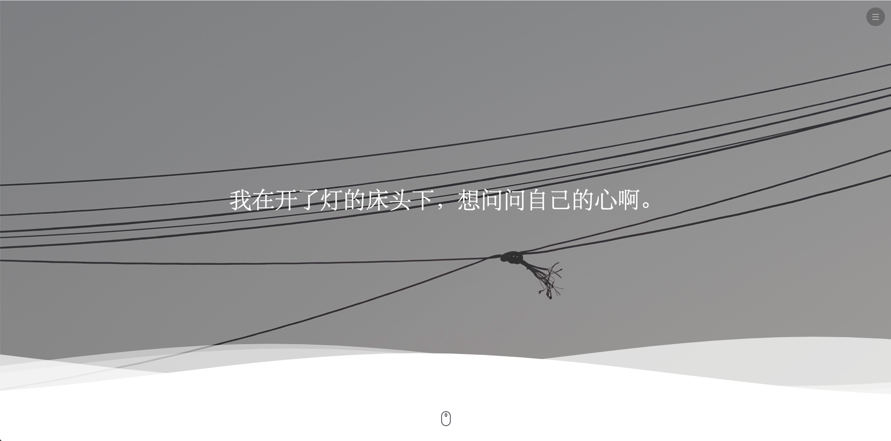
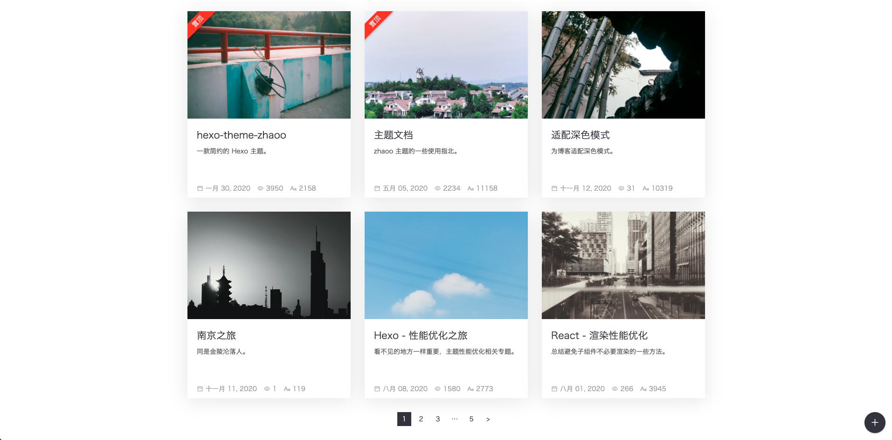
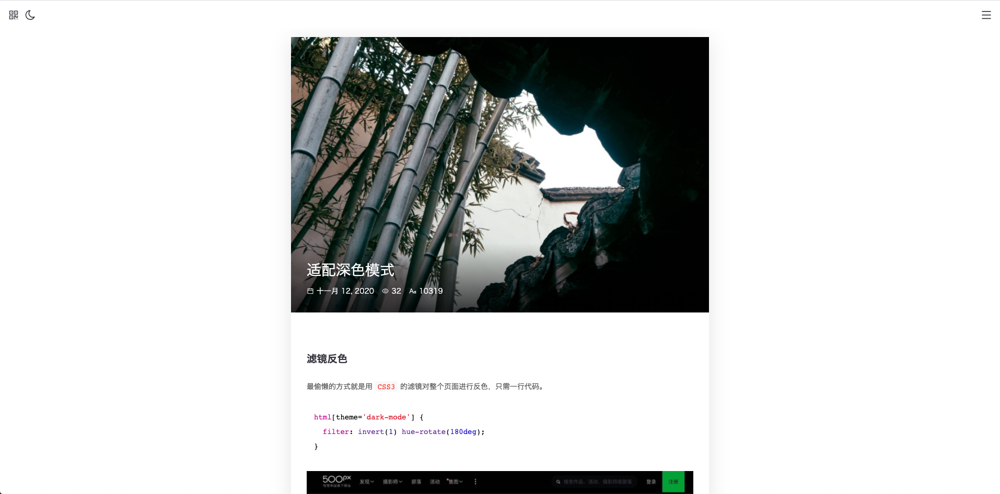
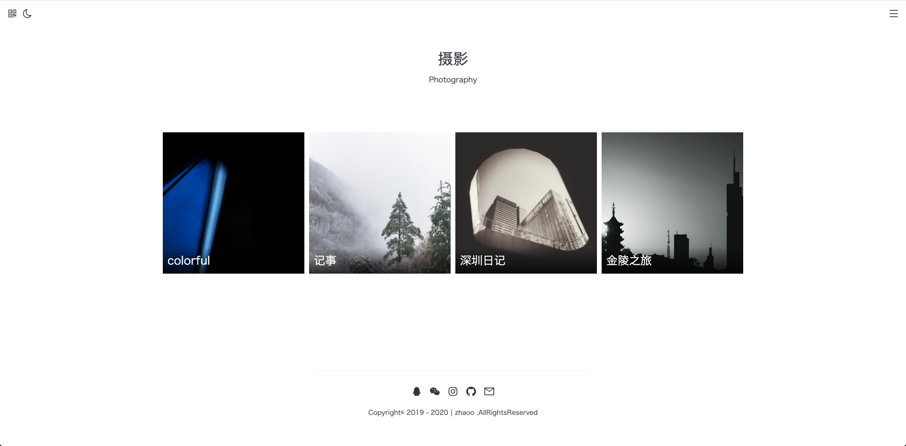
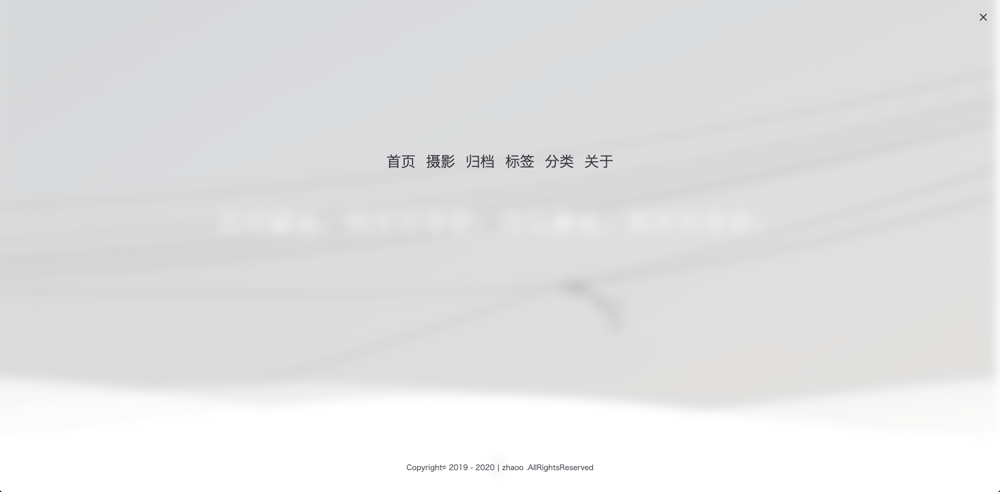

<div align="right">
  Language:
  <a title="简体中文" href="https://github.com/zhaoo/hexo-theme-zhaoo/blob/master/README.md">🇨🇳</a>
  <a title="English" href="https://github.com/zhaoo/hexo-theme-zhaoo/blob/master/README_EN.md">🇺🇸</a>
</div>

<div align="center">
  <a href="https://github.com/zhaoo/hexo-theme-zhaoo/" target="_blank" rel="noopener noreferrer">
    
  </a>
</div>

<h3 align="center">A simple theme for Hexo</h3>  

<div align="center">
  <a href="https://github.com/zhaoo/hexo-theme-zhaoo/releases" target="_blank" rel="noopener noreferrer">
    
  </a>
  <a href="https://hexo.io" target="_blank" rel="noopener noreferrer">
    
  </a>
  <a href="https://nodejs.org" target="_blank" rel="noopener noreferrer">
    
  </a>
  <a href="(https://github.com/zhaoo/hexo-theme-zhaoo/blob/master/LICENSE" target="_blank" rel="noopener noreferrer">
    
  </a>
</div>

<br/>

<div align="center">
  Documents: <a href="https://www.izhaoo.com/2020/05/05/hexo-theme-zhaoo-doc/" target="_blank" rel="noopener noreferrer">Documents</a>&nbsp;&nbsp;&nbsp;&nbsp;Preview:<a href="https://www.izhaoo.com/" target="_blank" rel="noopener noreferrer">zhaoo</a>
</div>

## Preview

- [zhaoo's Blog](https://www.izhaoo.com)
- [Handwer's Blog](https://blog.handwer-std.top/)
- [与李的个人博客](https://blog.javayuli.cn)
- [Live And Learn](https://kangshitao.github.io/)
- [Hexo](https://www.actor360.xyz/)
- [阿蓝故事](https://blog.zhangxiaocai.cn/)
- [kilic の 部落格](https://kilicmu.github.io/)
- [杨云召](https://flywith24.gitee.io/)
- [Mtaun](https://mtaun.top/)
- [汐语](https://xywangb.cn/)
- [Meizi's Blog](http://www.meizia.net/)
- [少年民仔](https://www.feminzai.com/)
- [iaosee's Blog](https://www.iaosee.com/)
- [Yin Blog](http://xuzhimo.top/)
- [卞卞不是便便](https://www.bianxr.com/)
- [CodeGorgeous](https://codegorgeous.github.io/)
- [Winterchen's Blog](https://blog.winterchen.com/)
- [rt](https://rt95.gitee.io)
- [杨某人的FOB](http://www.yzpdot.com/)
- [小州的博客](http://xiaozhoujun.gitee.io/)
- [DesnLee的博客](https://www.desnlee.com/)
- [米斯特乌小站](https://m.wuzhiping.top/)
- [中国的中古](https://medieval-china.club/)
- [樱白](https://cherry-white.github.io/)
- [隨遇而安](https://yuweikuo.github.io/)
- [学术文化时报 Times Academicculture](https://www.arlby.com/)

（If you are using the zhaoo theme, welcome to show your blog, just add your blog to the `README.md` and PR.）

## Characteristic

- [x] Design concept: Simple & Responsive & Animation
- [x] Comment: `Gitalk`、`Valine`、`ChangYan`
- [x] Feedback: [DaoVoice](http://www.daovoice.io/)、[Tencent Chao](https://txc.qq.com/)
- [x] Analytics: `LeanCloud`、`Baidu`、`CNZZ`、`google` and SEO
- [x] Dark scheme
- [x] Motto, support [Hitokoto](https://hitokoto.cn/)、[Poems Today](https://www.jinrishici.com/) and another dynamic mottos
- [x] Preview，support [Unsplash](https://unsplash.com/)、[Bing Pictures](https://cn.bing.com/) and another dynamic pictures
- [x] Galleries, pictures support waterfall
- [x] `highlight` code highlighting
- [x] `FancyBox` lightbox
- [x] `Pjax`
- [x] `lazyload`
- [x] `Alipay, Wechat` donate
- [x] Customized `Theme Style`、`CDN`、`Embedded Script`、`Social Link`、`Copyright`、`QRCode` and more

## Screenshots











## Install

After installing Hexo, go to the root directory:

```bash
$ cd hexo
```

To install zhaoo themes:

```bash
$ git clone https://github.com/zhaoo/hexo-theme-zhaoo.git themes/zhaoo
```

## Use

Modify the file `_config.yml` in the Hexo root directory to enable the zhaoo theme:

```yml
theme: zhaoo
```

It is recommended to change the number of articles to **9** and enable code highlighting:

```yml
index_generator:
  path: ''
  per_page: 9
  order_by: -date

highlight:
  enable: true
  line_number: true
  auto_detect: true
  hljs: true
  tab_replace:
```

Start preview of Hexo server:

```bash
$ hexo clean && hexo s
```

## Config

Modify the file `_config.yml` in the theme directory to configure related functions:

It is recommended to refer to [documents](https://www.izhaoo.com/2020/05/05/hexo-theme-zhaoo-doc/)、[_config.yml](https://github.com/zhaoo/hexo-theme-zhaoo/blob/master/_config.yml)、[_example](https://github.com/zhaoo/hexo-theme-zhaoo/tree/master/_example) for configuration

## Update

Jump to the theme directory：

```bash
$ cd themes/zhaoo
```

Get update from GitHub：

```bash
$ git pull
```

## Related

* Weapp: [hexo-weapp-zhaoo](https://github.com/zhaoo/hexo-weapp-zhaoo) (Weapp for Hexo)
* Plugin: [hexo-generator-restful-zhaoo](https://github.com/zhaoo/hexo-generator-restful-zhaoo) (RESTful API for Hexo)
* Exchange group: 550262893

## Contributors

[](https://github.com/zhaoo/hexo-theme-zhaoo/graphs/contributors)

Thanks to all contributors! Welcome to PR. (Please push to `develop` branch)

## Stargazers

[](https://starchart.cc/zhaoo/hexo-theme-zhaoo)

## License

[MIT](https://github.com/zhaoo/hexo-theme-zhaoo/blob/master/LICENSE) License
